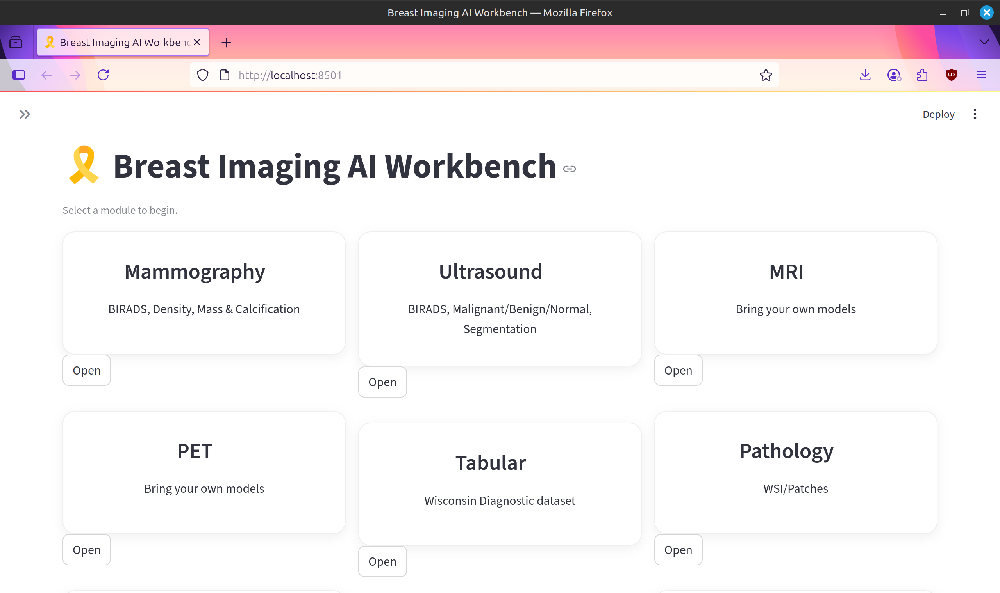
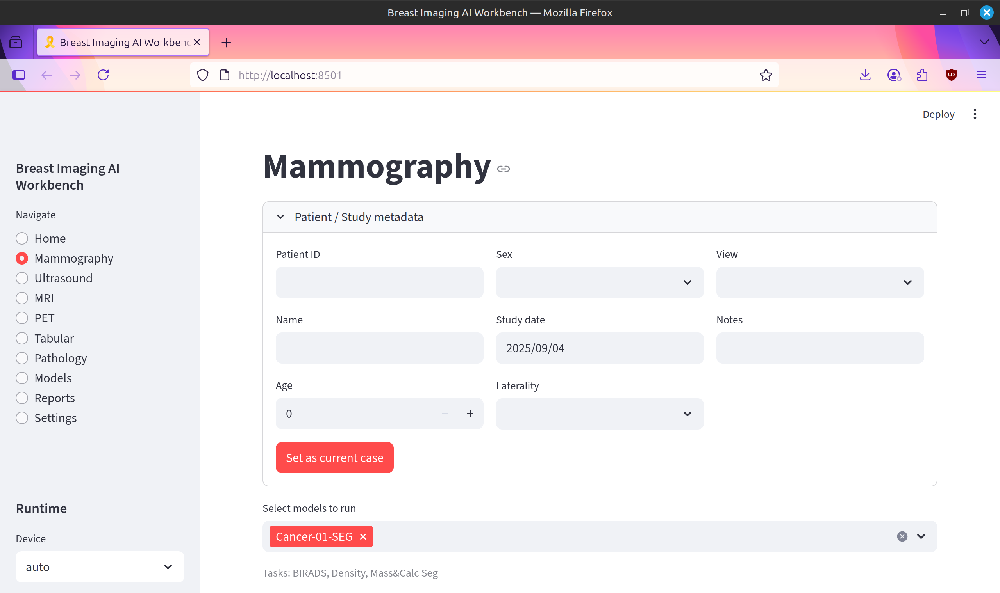
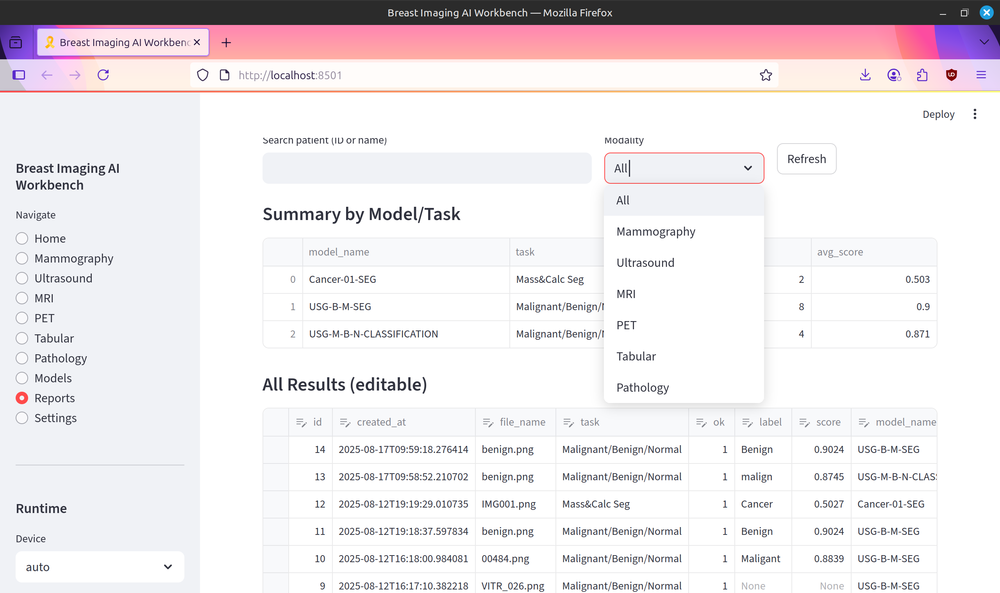

# Orionis - Breast-Imaging-AI-Workbench

> **EN:**  
> A Streamlit-based **AI workbench** for medical imaging, with a primary focus on **breast imaging**.  
> Upload and manage your **own deep learning models** (YOLO, Keras, PyTorch, ONNX) and run **object detection, segmentation, and classification** across multiple imaging modalities.  
> Store and track **patient/study metadata**, run inferences, and automatically generate **case reports**.  
> Reports can be further **polished with Gemini** for clinician-friendly wording and professional formatting.  
> The system also includes a **tabular module** (e.g., **Wisconsin Diagnostic dataset**) for fast baseline experiments on structured data.  
> Designed as a **proof-of-concept** to demonstrate how a modular AI workbench could look, extensible to other imaging types (Ultrasound, MRI, PET, Pathology).

⚠️ **Medical Disclaimer:** This is a proof-of-concept research tool. Not a medical device. Do not use for clinical decision-making.

---

> **TR:**  
> Streamlit tabanlı bir **AI çalışma ortamıdır** ve öncelikli olarak **meme görüntülemesi (mamografi)** odaklıdır.  
> **Kendi derin öğrenme modellerinizi** (YOLO, Keras, PyTorch, ONNX) yükleyebilir; **mamografi, ultrason, MRI, PET, patoloji** gibi farklı modalitelerde **tespit (object detection)**, **segmentasyon** ve **sınıflandırma** çalıştırabilirsiniz.  
> Ayrıca **tabular veri modülü** (örn. **Wisconsin Diagnostic dataset**) ile yapılandırılmış veriler üzerinde hızlı **ML denemeleri** yapılmasına olanak sağlar.  
> Hasta ve çalışma (case) bilgilerini saklayabilir, sonuçları kaydedebilir ve otomatik olarak **raporlar üretebilirsiniz**.  
> Raporlar ayrıca **Gemini** entegrasyonu sayesinde daha **okunaklı ve klinisyen-dostu** bir şekilde cilalanabilir.  
> Bu uygulama yalnızca bir **konsept kanıtı (Proof-of-Concept)** olarak geliştirilmiştir ve zamanla daha fazla modalite ile genişletilebilir.


⚠️ **Tıbbi Uyarı:** Bu proje **tıbbi cihaz değildir**, gerçek klinik karar desteği için kullanılmamalıdır.

---

## Screenshots

### Home Page




### Report Example


---

## Key Features

- **Model Registry:** Add YOLO / Keras / PyTorch / ONNX models with metadata.
Inference:
  - YOLO (detect/segment) with optional overlays/masks.
  - Keras / TensorFlow & PyTorch classification.
  - ONNX inference (CPU by default).

- **Cases & Results:**
  - Store patient/study metadata and results in SQLite.
  - Results table, image gallery (overlays), and case reports.

- **Reporting:**
  - Auto-generate a draft report from model outputs.
  - Optional Gemini polish for clinician-friendly wording.

- **Tabular Module:**
  - Wisconsin Diagnostic demo with quick Logistic Regression baseline.

- **Theming & Runtime:**
  - Theme colors, compact density.

- **Device selector:** auto | cpu | cuda:0 | cuda:1.

---

## **Directory Layout (auto-created on first run)**

### breast_ai_workbench/
##### ├─ db/ # SQLite DB
##### ├─ img/ # Uploaded images
##### └─ models/ # Uploaded model files

---

## 🧱 Tech Stack
- UI: **Streamlit**
- Data: **SQLite**, **pandas**
- Imaging: **Pillow (PIL)**
- AI Backends (plug-and-play / optional)
  - **ultralytics (YOLO)** + (optional) **torch**
  - **tensorflow/keras**
  - **onnxruntime**
  - **scikit-learn** (tabular)
- Optional polishing: **google-generativeai (Gemini)**

---

## Quickstart

### 1) Environment
- **Python** 3.10–3.12 recommended
- (Optional) **CUDA** + compatible **PyTorch** if you want GPU

```bash
# clone
git clone https://github.com/BoranT-3000/Orionis---Breast-Imaging-AI-Workbench
cd Orionis---Breast-Imaging-AI-Workbench

# venv
python -m venv .venv
# Windows:
# .venv\Scripts\activate
# macOS/Linux:
source .venv/bin/activate

# install
pip install --upgrade pip
pip install -r requirements.txt

# run
streamlit run app.py


